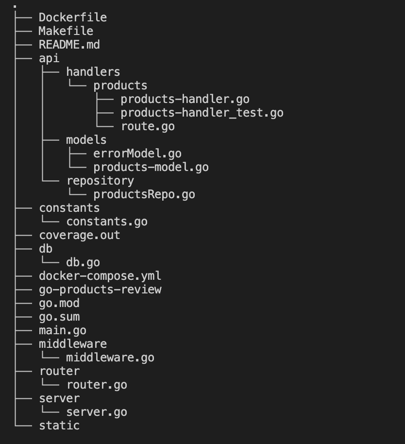

# go-products-review

go-products-review is a simple web application helps in adding the review to the products and getting all the products using MongoDB.
It is written using <a href="https://github.com/gin-gonic/gin"><strong>Gin Web Framework</strong></a> to make server high performant

## Contents
- [Go Products Review](#go-products-review)
  - [1. Usage](#usage)
  - [2. Design Pattern](#1-design-pattern)
  - [3. Middleware](#2-middleware)
  - [4. Frameworks](#3-frameworks)
  - [5. About App](#4-about-app)
  - [6. Performance Metrics](#performance-metrics)
  - [7. Limitations](#limitations)

## 1. Usage

To install go-products-review, you need to install [Go](https://golang.org/)(**version 1.17+ is required**) and set your Go workspace.

Clone the project, And navigate to the project.

---
```markdown
$ 
```
---

---
```go
To run the web app locally, you need to have mongodb connection:
and set the environment variables as 

```
export AUTH_USERNAME=IDT
export AUTH_PASSWORD=password
export MONGO_CONNECTION_URI=localhost:27017
```

Change the Mongo Connection URI if needed. 

After setting the env variables, run the below command to run app in local:

```
$ go run .
```

```
---

Once you run the app, to health check you can make the following cURL

---
```markdown
curl --location --request GET 'http://localhost:8080/healthcheck'
```
---
To run all the test cases written

---
```markdown
$ make test
```
---
To run test coverage

$ make test_coverage

This project also supports Docker-Compose, to run the app using docker-compose 

---
```markdown
$ docker-compose up
```
---

---
```go
If the docker has some cache, run the following command
```
---

```
$ docker-compose down && docker-compose build --no-cache && docker-compose up
```

## 2. Design Pattern

Since we are using the Gin web framework, we made the application rest api routes very easy.

Project structure is as 



## 3. Middleware

Out of the box Gin web framework allows you to add the middleware functions and also it provides basic functionality of logging the API's.

### Basic Authentication

This app supports the basic authentication with default username `IDT`,  password as `password`.

## 4. Frameworks
Using the below frameworks in this project:
1. <a href="https://github.com/gin-gonic/gin"><strong>Gin Web Framework</strong></a>
2. <a href="https://github.com/stretchr/testify"><strong>Stretchr Framework for Test Cases</strong></a>
3. <a href="https://github.com/jaswdr/faker"><strong>Faker for faking the name strings etc..</strong></a>
4. <a href="https://go.mongodb.org/mongo-driver"><strong>Mongo Driver for interacting with mongodb</strong></a>

## 5. About App

Go-Product-Review service:

You can download the postman collection here :

<a href="./static/products.postman_collection.json"><strong>POSTMAN COLLECTION</strong></a> 

1. Creates the new product

---
```markdown
curl --location --request POST 'http://localhost:8080/api/v1/product' \
--header 'Authorization: Basic SURUOnBhc3N3b3Jk' \
--header 'Content-Type: application/json' \
--data-raw '{
    "name": "IDT Product",
    "description": "description"
}'
```
---
2. Gets the products
---
---
```markdown
curl --location --request GET 'http://localhost:8080/api/v1/products?page=1&limit=10&name=gr' \
--header 'Authorization: Basic SURUOnBhc3N3b3Jk'
```
---
3. Create new sale

---
```markdown
curl --location --request POST 'http://localhost:8080/api/v1/product/<product_id>/review' \
--header 'Authorization: Basic SURUOnBhc3N3b3Jk' \
--header 'Content-Type: application/json' \
--data-raw '{
    "name": "Anil",
    "review": "Anil'\''s Review",
    "rating": 5
}
 '
```
---
## 6. Performance Metrics
Benchmarking for this application is not done.
<p align="justify"><i>"As this application uses Gin web framework, the default logs of Gin server shows how much time is consumed by each request to send response back."</i></p>

## 7. Limitations
1. The server is running on http mode.
